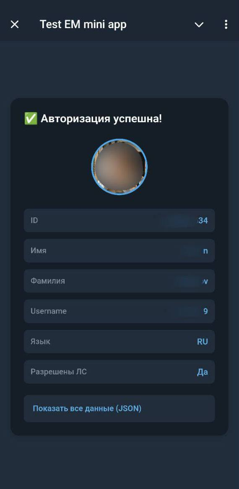
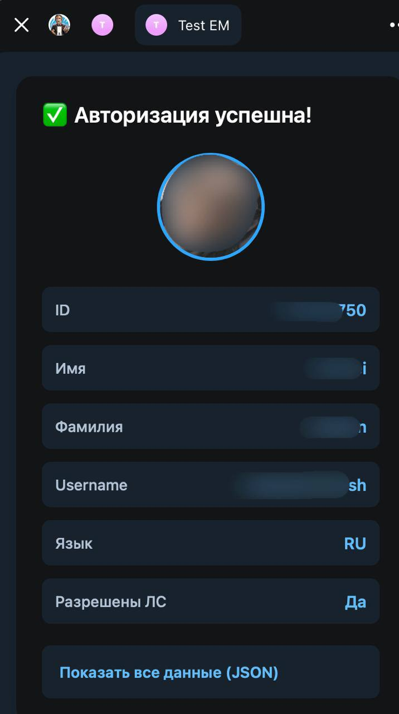
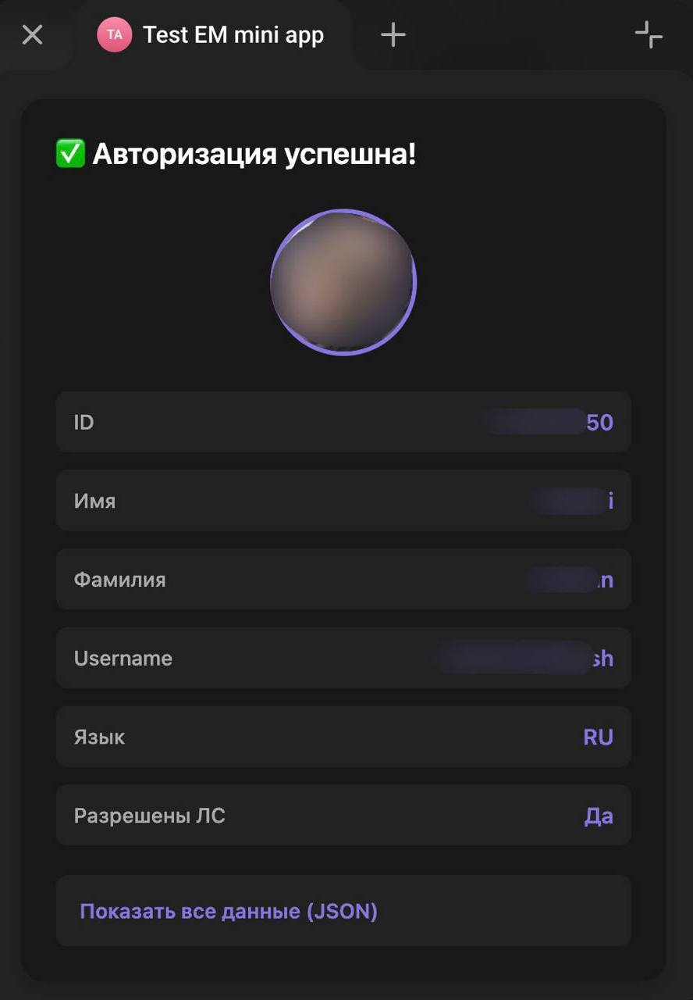

## Telegram Mini App - Бесшовная авторизация пользователя

Тестовое задание на позицию стажёра frontend-разработчик: реализация бесшовной авторизации в Telegram Mini App с отображением
информации о пользователе.

---

### Мобильная версия (Android)

### Desktop версия - адаптация под нативный дизайн

  
  

*Приложение автоматически адаптируется под дизайн разных Telegram тем*

---

### Основной функционал

- Бесшовная авторизация через `initData`, которая валидируется на бэкенде через проверку hash
- Бот проверяет, что пользователь находится в том же чате
- Нет хранения чувствительных данных на фронтенде
- Автоматическое определение временной зоны пользователя (формат IANA)
- Отображение всех данных пользователя из API
- Нативный дизайн под Telegram

### Технологии

- **Frontend Framework:** React 18
- **Язык:** TypeScript
- **Сборщик:** Vite
- **Telegram SDK:** @tma.js/sdk v3.1
- **Стилизация:** Pure CSS с CSS Variables
- **API:** REST API (fetch)
